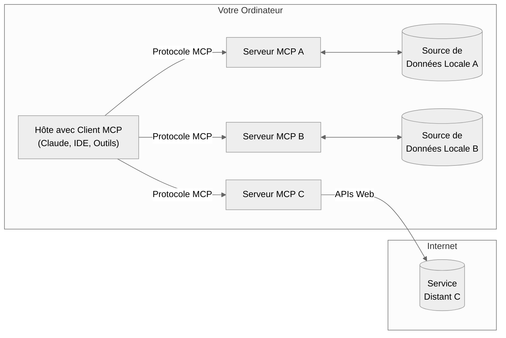
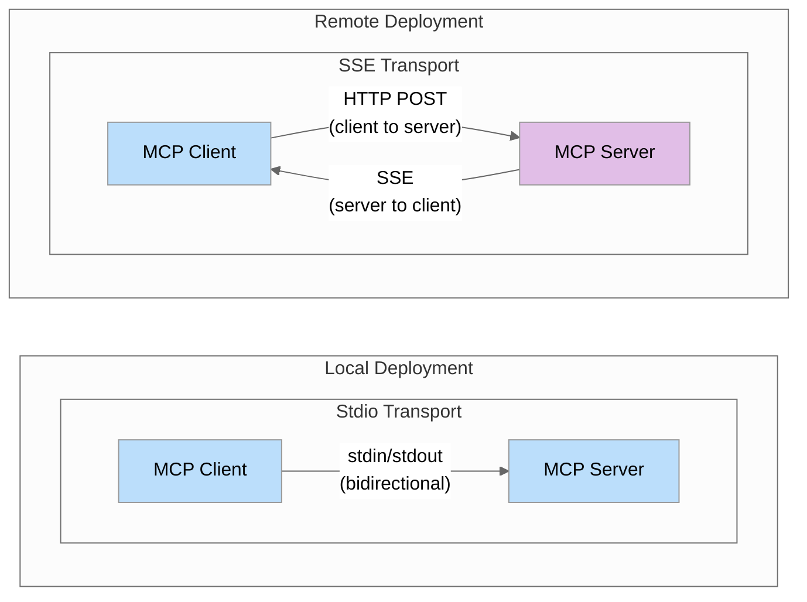

## Partie 2 : Comprendre le MCP à un niveau technique

### Aperçu de l'architecture MCP

Le Model Context Protocol suit une architecture client-hôte-serveur :

Cette séparation des préoccupations permet de créer des systèmes modulaires et composables où chaque serveur peut se concentrer sur un domaine spécifique (comme l'accès aux fichiers, la recherche sur le web, ou les opérations de base de données).

- **Hôtes MCP** : Programmes comme Claude Desktop, les IDE, ou votre application Python qui souhaitent accéder aux données via MCP
- **Clients MCP** : Clients du protocole qui maintiennent des connexions 1:1 avec les serveurs
- **Serveurs MCP** : Programmes légers qui exposent chacun des capacités spécifiques via le Model Context Protocol standardisé (outils, ressources, invites)
- **Sources de données locales** : Fichiers, bases de données et services de votre ordinateur auxquels les serveurs MCP peuvent accéder de manière sécurisée
- **Services distants** : Systèmes externes disponibles sur Internet (par exemple, via des API) auxquels les serveurs MCP peuvent se connecter

Cette séparation des préoccupations permet de créer des systèmes modulaires et composables où chaque serveur peut se concentrer sur un domaine spécifique (comme l'accès aux fichiers, la recherche sur le web, ou les opérations de base de données).

MCP définit trois primitives de base que les serveurs peuvent implémenter :

1. [Outils](https://modelcontextprotocol.io/docs/concepts/tools#python) : Fonctions contrôlées par le modèle que les LLMs peuvent invoquer (comme des appels d'API, des calculs)
2. [Ressources](https://modelcontextprotocol.io/docs/concepts/resources#python) : Données contrôlées par l'application qui fournissent du contexte (comme le contenu de fichiers, les enregistrements de base de données)
3. [Invites](https://modelcontextprotocol.io/docs/concepts/prompts#python) : Modèles contrôlés par l'utilisateur pour les interactions LLM

Pour les développeurs Python, la primitive la plus utile immédiatement est les outils, qui permettent aux LLMs d'effectuer des actions de manière programmatique.

### Approfondissement des mécanismes de transport

MCP supporte deux mécanismes de transport principaux :

1. **Stdio (Standard IO)** :
   - La communication se fait via les flux standard d'entrée/sortie
   - Idéal pour les intégrations locales lorsque le serveur et le client sont sur la même machine
   - Configuration simple sans besoin de configuration réseau

2. **SSE (Server-Sent Events)** :
   - Utilise HTTP pour la communication client-serveur et SSE pour la communication serveur-client
   - Convient pour les connexions distantes à travers les réseaux
   - Permet des architectures distribuées

Comprendre quand utiliser chaque transport est crucial pour construire des implémentations MCP efficaces :

- Utilisez **Stdio** lors de la construction d'intégrations pour une seule application ou pendant le développement
- Utilisez **SSE** lorsque vous avez besoin d'un accès distant ou que vous intégrez avec des clients qui le nécessitent

#### Comparaison des mécanismes de transport

Si vous êtes familier avec FastAPI, vous trouverez que l'implémentation d'un serveur MCP avec le transport SSE semble très similaire. Les deux frameworks utilisent des points de terminaison HTTP pour recevoir les requêtes et supportent les réponses en streaming en utilisant les Server-Sent Events. Ils permettent tous les deux de définir des gestionnaires pour des routes/points de terminaison spécifiques et fournissent des motifs async/await pour gérer les requêtes et générer des réponses. Cette similarité facilite la transition pour les développeurs FastAPI vers la construction de serveurs MCP, car ils peuvent tirer parti de leurs connaissances existantes en HTTP, en programmation asynchrone et en réponses en streaming.

### Un nouveau standard

La véritable puissance de MCP ne réside pas dans l'introduction de nouvelles capacités, mais dans la standardisation de la manière dont ces capacités sont exposées et consommées. Cela offre plusieurs avantages clés :

- **Réutilisabilité** : Construisez un serveur une fois, utilisez-le avec n'importe quel client compatible MCP
- **Composabilité** : Combinez plusieurs serveurs pour créer des capacités complexes
- **Croissance de l'écosystème** : Bénéficiez des serveurs créés par d'autres

L'écosystème MCP est déjà en croissance rapide, avec des serveurs disponibles pour de nombreux outils. Vous pouvez trouver un aperçu ici : [Serveurs officiellement supportés](https://github.com/modelcontextprotocol/servers)

Cela signifie que vous pouvez tirer parti des serveurs existants plutôt que de réinventer la roue, et contribuer avec vos propres serveurs pour bénéficier à la communauté.
